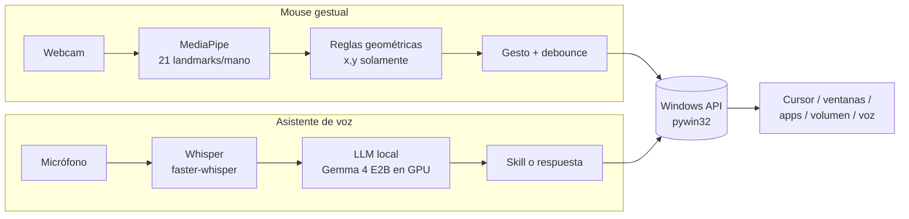
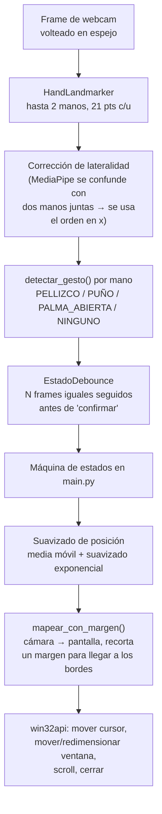
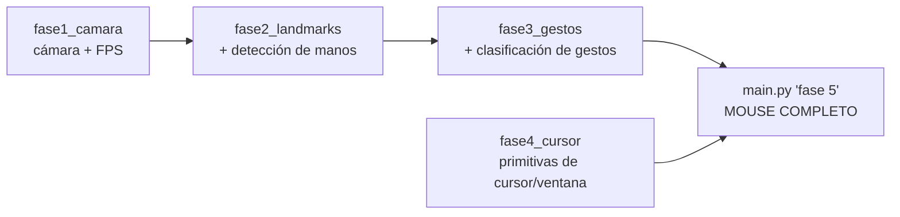
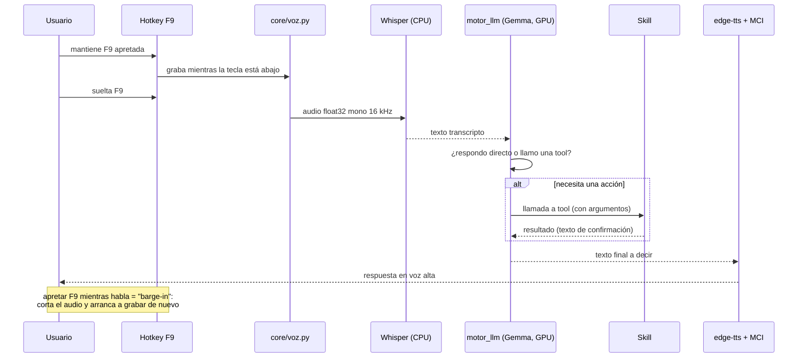

# Viernes

**Viernes** es una **IA local con *tool calling*** para controlar tu PC con Windows
sin depender de la nube ni de suscripciones de pago. Se mantiene apretada una tecla,
se habla, Whisper transcribe y un LLM que corre **en la propia máquina** (Gemma, en
`agente/`) decide si simplemente responde o si ejecuta una *skill*; después contesta
en voz alta.

Las **skills** son las capacidades concretas que Viernes puede invocar:

- **Manos** — la primera que se construyó, y de la que nació el proyecto: una webcam +
  MediaPipe rastrean las manos y con gestos simples (dedos extendidos, distancia de
  pellizco) se mueve el cursor real de Windows, se arrastran y redimensionan ventanas,
  se hace scroll y se cierran aplicaciones. Corre como un proceso aparte (`main.py` +
  `fase1-4`) y puede usarse sola, pero conceptualmente es una capacidad más de Viernes.
- **El resto** — abrir apps, volumen maestro, Spotify, carpetas, manejo de ventanas,
  hora y fecha, preguntar a ChatGPT.

La idea de fondo: que la asistencia sea local y sin suscripciones, y que agregar una
capacidad nueva sea agregar una skill más al set que la IA ya sabe orquestar.

Todo el código, los comentarios y los mensajes de commit están en español, a propósito.

> El proyecto asume **Windows 10** y una sola PC de usuario. No es multiplataforma.

---

## Tabla de contenido

- [Cómo funciona: la idea de fondo](#cómo-funciona-la-idea-de-fondo)
- [La skill de manos (mouse gestual)](#la-skill-de-manos-mouse-gestual)
  - [Pipeline](#pipeline)
  - [Gestos y qué hacen](#gestos-y-qué-hacen)
  - [Los archivos `faseN`](#los-archivos-fasen)
- [El agente: la IA con tool calling (`agente/`)](#el-agente-la-ia-con-tool-calling-agente)
  - [Ciclo de un comando](#ciclo-de-un-comando)
  - [El motor LLM local](#el-motor-llm-local)
  - [Skills disponibles](#skills-disponibles)
- [Tecnología](#tecnología)
- [Hardware de referencia](#hardware-de-referencia)
- [Cómo correrlo](#cómo-correrlo)
- [Estado del proyecto](#estado-del-proyecto)

---

## Cómo funciona: la idea de fondo

El núcleo es la IA: **voz → Whisper → LLM local → ¿responde o llama una skill? →
acción sobre Windows → respuesta hablada.** La skill de manos sigue el mismo espíritu
por su cuenta — **una señal cruda del mundo real → una interpretación barata y
explícita → una acción sobre Windows vía `pywin32`** — pero sin pasar por el LLM.



Decisión de diseño clave del mouse: **solo se usan las coordenadas `x,y`** de los
landmarks. El eje `z` de MediaPipe (profundidad estimada) resultó demasiado ruidoso
para gestos como un "tap en el aire", así que se descartó. Con `x,y` quedan dos
primitivas fiables — *distancia entre dos puntos* y *¿está un dedo extendido?*
(comparar `tip.y` contra `pip.y`) — y todos los gestos se construyen con esas dos.

---

## La skill de manos (mouse gestual)

Fue lo primero que se construyó y de ahí salió todo el proyecto. Corre como proceso
independiente (no lo importa nada del agente), así que no puede romper el resto.

### Pipeline



Detalles que son fáciles de romper si se edita a ciegas (ver `CLAUDE.md` para el
detalle completo):

- **Click y arrastre son el mismo gesto crudo** (`PELLIZCO`); se distinguen por
  cuánto dura. Un pellizco corto que se suelta rápido = click; sostenido = arrastre.
- **Cuatro estados mutuamente excluyentes**: pellizco de una mano → mover cursor /
  arrastrar ventana; pellizco de las dos manos → redimensionar; puño sostenido con
  ventana ya agarrada → cuenta regresiva para cerrarla; puño sin ventana agarrada →
  scroll con inercia.
- **El cursor real se *congela* mientras la mano que lo controla hace `PUÑO`** — sin
  esto, hacer scroll arrastraba el cursor fuera de la ventana y los eventos de rueda
  caían en otro lado.
- El suavizado es de dos etapas por mano, y el margen de mapeo amplifica el temblor
  de la mano, por eso existe una *deadzone* que ignora micro-movimientos.

### Gestos y qué hacen

| Gesto | Acción |
|---|---|
| Pellizco corto (pulgar + índice) | Click izquierdo |
| Pellizco sostenido, una mano | Arrastrar la ventana bajo el cursor |
| Pellizco con **ambas** manos | Redimensionar (mano derecha = esquina sup. derecha, izquierda = esquina inf. izquierda) |
| Puño sostenido mientras se arrastra | Cerrar la ventana (cuenta regresiva, cancelable abriendo la mano) |
| Puño sin ventana agarrada | Scroll vertical, con inercia al soltar |
| Llevar la ventana a un borde | Aero Snap reimplementado (arriba = maximizar, lados = media pantalla) |

Salir de cualquier ventana de cámara: tecla `q` con la ventana de OpenCV enfocada.

### Los archivos `faseN`

El proyecto se construyó por checkpoints. Cada `faseN_*.py` es ejecutable de forma
independiente y fue un hito hacia `main.py`:



`main.py` es el punto de entrada real e **importa** de `fase2`, `fase3` y `fase4`
(son módulos, no solo scripts). La cadena de voz vieja (`fase6`–`fase10`) es
independiente y nunca toca `main.py` ni `fase1-4`.

| Archivo | Qué es |
|---|---|
| `fase1_camara.py` | Cámara + overlay de FPS |
| `fase2_landmarks.py` | + detección y dibujo de landmarks |
| `fase3_gestos.py` | Clasificación pura de gestos, sin I/O + `EstadoDebounce` |
| `fase4_cursor.py` | Wrappers finos sobre `win32api`/`win32gui`, DPI-aware, multi-monitor, Aero Snap |
| `main.py` | Máquina de estados por frame que ata todo — **el mouse gestual** |
| `fase6_asistente.py` | Primeras acciones de asistente (abrir app, ChatGPT, volumen, leer en voz alta) |
| `fase7_voz.py` | Test de latencia de grabación + transcripción con faster-whisper |
| `fase8_wakeword.py` | Escucha la palabra "Viernes" (match difuso, sin motor de wake-word dedicado) |
| `fase9_asistente_voz.py` | Bucle completo: wake word → Whisper → ¿comando conocido? → ejecutar |
| `fase10_asistente_ptt.py` | Push-to-talk (mantener F9), ícono en la bandeja. Precursor de `agente/` |

> Las fases 6–10 fueron la primera versión del asistente, con un despachador de
> *intents* fijo (matching de palabras clave, sin LLM). Funcionan y quedan como
> están, pero `agente/` las reemplaza con un LLM real.

---

## El agente: la IA con tool calling (`agente/`)

El corazón de Viernes. Sub-proyecto **deliberadamente aislado**: no importa nada de `fase1-4` / `main.py` /
`fase6-10`, para poder moverlo a su propio repo sin arrastrar el mouse gestual. Lo
que necesitaba de esos archivos se **reescribió** (portado, no importado).

```
agente/
├── main.py            # bucle push-to-talk (F9), ícono de bandeja, orquesta el turno
├── core/
│   ├── voz.py         # grabación (sounddevice) + STT (faster-whisper) + TTS (edge-tts)
│   ├── motor_llm.py   # carga Gemma 4 E2B en GPU vía litert-lm-api, ejecuta el turno
│   └── logs.py        # log rotativo de cada turno (a privado/, no se sube)
└── skills/
    ├── apps.py        # abrir aplicaciones (índice del Menú Inicio de Windows)
    ├── volumen.py     # volumen maestro (pycaw)
    ├── chatgpt.py     # preguntar a ChatGPT vía navegador (Playwright)
    ├── tiempo.py      # hora y fecha actual
    ├── carpetas.py    # abrir carpetas conocidas y proyectos
    ├── ventanas.py    # cerrar / minimizar ventanas (win32gui)
    └── spotify.py     # control de Spotify (Web API, requiere Premium)
```

### Ciclo de un comando



Estados del turno (para decidir qué hacer si se aprieta F9 de nuevo antes de que el
turno anterior termine): **idle** → **procesando** (transcribiendo/pensando, se
ignora F9) → **hablando** (reproduciendo respuesta, F9 hace barge-in).

### El motor LLM local

- **Modelo:** `Gemma 4 E2B` (variante "litert-lm", cuantizada) — entra cómodo en los
  4 GB de VRAM de una GTX 1650.
- **Runtime:** `litert-lm-api` con backend **GPU**. En la Fase 0 del plan se
  compararon varios motores; este ganó con 10/10 de precisión en las frases de
  prueba y **1–2 s por comando en GPU** (vs. 5–9 s en CPU).
- **Tool calling automático:** las skills son funciones Python normales con *type
  hints* y docstring `Args:`; `litert-lm-api` arma el schema solo y ejecuta la
  función cuando el modelo la llama. Un `ToolEventHandler` registra cada llamada
  (nombre, argumentos, resultado) para el log y para el *fallback* de voz.
- **Sin estado entre turnos:** cada comando es una conversación nueva. Por eso
  `tiempo.py` existe — el modelo no tiene reloj propio ni sabe qué día es.
- **Prompt de sistema:** le dice que es "Viernes", que responda en español y breve
  (se lee en voz alta), que use una tool si el pedido es una acción disponible, que
  responda directo si es conocimiento general, y que use la tool de internet en vez
  de inventar cuando no sabe algo actualizado.

### Skills disponibles

| Skill | Qué hace | Detalle técnico |
|---|---|---|
| **apps** | Abrir aplicaciones de escritorio | Arma un índice real de lo instalado leyendo los `.lnk` del Menú Inicio (ambas carpetas estándar) y resolviéndolos a su ejecutable vía `WScript.Shell`. Fuzzy-match para nombres transcriptos por voz. Sin shell (evita inyección) |
| **volumen** | Volumen maestro: fijar %, subir, bajar, silenciar | `pycaw` → `AudioDevice.EndpointVolume` |
| **chatgpt** | Preguntar a ChatGPT / buscar en internet | Playwright con perfil persistente de Chromium, `--start-minimized` (headless lo bloquea Cloudflare). Contexto de navegador reusado entre preguntas |
| **tiempo** | Hora y fecha actual | `datetime.now()`, formateado en español |
| **carpetas** | Abrir Escritorio/Documentos/Descargas y proyectos | Match por contención + fuzzy sobre `Documents/Proyectos/` |
| **ventanas** | Cerrar / minimizar ventanas | `win32gui.EnumWindows` + búsqueda por título. Si hay ambigüedad, no cierra nada: pide aclarar |
| **spotify** | Reproducir canción/playlist/mood, siguiente/anterior, pausa | Web API de Spotify con `urllib` (sin librería). Requiere Premium + correr `scripts/spotify_auth.py` una vez. Playlists arrancan en aleatorio; el play apunta al `device_id` explícito para no quedar mudo |
| **manos_libres** | Activar / desactivar el control por gestos de la mano | Lanza `main.py` (mouse gestual) como **proceso aparte** vía `subprocess` — no importa nada de `fase1-4`, así que no puede tumbar al agente. `atexit` lo cierra al salir |

---

## Tecnología

### Mouse gestual
| Área | Herramienta |
|---|---|
| Visión | `mediapipe` (HandLandmarker), `opencv-python` |
| Control de Windows | `pywin32` (`win32api`, `win32gui`), `PyAutoGUI` |

### Asistente de voz
| Área | Herramienta |
|---|---|
| Grabación | `sounddevice` (InputStream + callback continuo) |
| STT | `faster-whisper` (`small`, CPU, `int8`) — backend `ctranslate2`, sin torch |
| LLM | `litert-lm-api` + `Gemma 4 E2B` en GPU |
| TTS | `edge-tts` (voz `es-MX-DaliaNeural`, `+15%`), reproducido con MCI (`winmm.dll`) |
| Hotkey | `keyboard` (hook global de bajo nivel) |
| Bandeja | `pystray` + `Pillow` (íconos generados en memoria) |
| Skills | `pycaw` + `comtypes` (volumen), `playwright` (ChatGPT), `win32com`/`win32gui` |

No hay `requirements.txt`: las dependencias viven solo en `venv/`. Tras un venv nuevo
hay que correr `playwright install chromium` una vez.

---

## Hardware de referencia

Todo se probó y ajustó en esta máquina:

- **CPU:** Intel Core i5-10300H · **GPU:** NVIDIA GTX 1650, **4 GB VRAM** · **RAM:** ~16 GB
- **OS:** Windows 10 IoT Enterprise LTSC 2021 (Windows 10, no 11 — sin funciones de voz on-device de Copilot+/NPU)
- El *delegate* GPU de MediaPipe está **deshabilitado en el build pip de Windows**, así
  que HandLandmarker corre **solo en CPU** (~80 fps sin manos en frame — no es el
  cuello de botella; lo era la captura de cámara).
- Con 4 GB de VRAM entra cómodo un modelo de 3–4B; los de 7–8B corren con offload
  parcial a CPU (más lento).

---

## Cómo correrlo

Usar siempre el Python del venv del proyecto, no uno del sistema.

**Mouse gestual:**
```
./venv/Scripts/python.exe main.py
```

**Asistente de voz (nuevo, con LLM):**

Antes de la primera corrida hay que crear la config local (nada de esto se sube
a git):

```
cp agente/config.example.json agente/config.json   # y editar model_path, etc.
cp agente/.env.example        agente/.env           # solo si vas a usar Spotify
```

- **`agente/config.json`** — ajustes **no secretos** propios de esta máquina: ruta
  al `.litertlm`, backend (`gpu`/`cpu`), modelo de Whisper, voz de TTS, tecla de
  push-to-talk, carpeta de proyectos, saludo de arranque (`saludo.frases` / `saludo.usar_llm`).
  Se ignora en git; `config.example.json` es la plantilla que sí se sube.
- **`agente/.env`** — **solo credenciales** (`SPOTIFY_CLIENT_ID` / `SPOTIFY_CLIENT_SECRET`).
  Se ignora en git; `.env.example` es la plantilla.

```
./venv/Scripts/python.exe agente/main.py
```
Mantener **F9** apretada para hablar; el ícono de la bandeja muestra el estado
(gris = esperando, azul = grabando, naranja = procesando). Salir por el menú del
ícono ("Salir").

Para la skill de Spotify, además: `./venv/Scripts/python.exe agente/scripts/spotify_auth.py`
una vez (autoriza en el navegador y cachea el token en `agente/.spotify_token_cache`, gitignored).

**Abrir Viernes con doble palmada** (opcional): se lanza con un atajo de teclado — creá un
acceso directo a `venv\Scripts\pythonw.exe agente\scripts\abrir_por_palmada.py`, en sus
Propiedades asignale una "Tecla de método abreviado" (ej. `Ctrl+Alt+J`), o mapeá una tecla
en G-Helper a ese mismo atajo. Como no tiene ventana propia, avisa con un cartelito breve
abajo a la derecha: azul al empezar a escuchar, verde al detectar la doble palmada (lanza
el agente y se cierra), gris si pasan `palmada.escucha_segundos` sin palmada y se cierra
solo. Nada queda escuchando en reposo. Los parámetros de `palmada` en `config.json` son los
de `jarvis_template` (ya calibrados).

**Fases sueltas (checkpoints):**
```
./venv/Scripts/python.exe fase1_camara.py       # cámara + FPS
./venv/Scripts/python.exe fase3_gestos.py       # clasificación de gestos
./venv/Scripts/python.exe fase4_cursor.py       # primitivas de cursor, menú por teclado
./venv/Scripts/python.exe fase10_asistente_ptt.py  # asistente por voz viejo (intents fijos)
```

No hay argumentos de CLI, tests, config de lint ni build.

---

## Estado del proyecto

- ✅ **Mouse gestual** — completo y estable (`main.py`).
- ✅ **Asistente de voz con LLM local** (`agente/`) — pipeline funcionando: F9 →
  Whisper → Gemma en GPU → skill / respuesta → voz. 7 skills activas.
- 🔜 En curso: más skills (`carpetas`, `spotify`, `tiempo`, `ventanas` recién
  agregadas), refinamiento de `apps` y `chatgpt`, scripts auxiliares en
  `agente/scripts/`.

`privado/` es una carpeta local (gitignored) para notas, modelos descargados,
perfiles de navegador y logs — nada de eso se sube.
