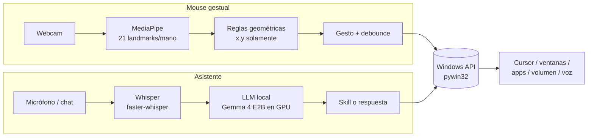
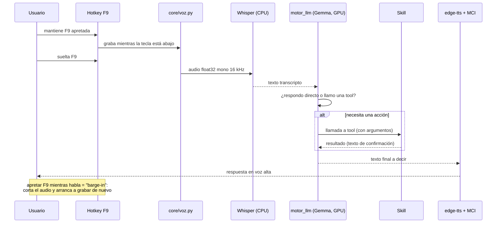
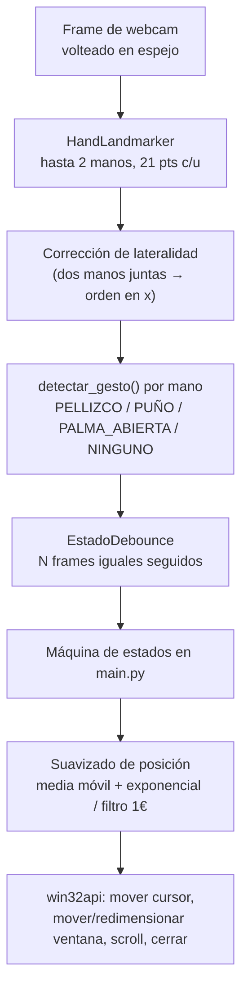

# Viernes

**Viernes** es una **IA local con _tool calling_** para controlar una PC con
Windows sin depender de la nube ni de suscripciones de pago. Se mantiene
apretada una tecla, se habla; `faster-whisper` transcribe, un LLM que corre
**en la propia máquina** (`Gemma 4 E2B` en GPU) decide si responde directo o
si ejecuta una _skill_, y contesta en voz alta. También hay una ventana de
chat para escribirle: va al mismo motor local, con las mismas skills.

La **skill de manos** (`mouse_gestual/`) fue lo primero que se construyó y
de ahí nació el proyecto: una webcam + MediaPipe siguen ambas manos y con
gestos simples se maneja el cursor real de Windows. Corre como proceso
aparte y el asistente la enciende/apaga por voz — conceptualmente es una
capacidad más de Viernes.

> Asume **Windows 10** y una sola PC de usuario. No es multiplataforma.
> Todo el código, los comentarios y los commits están en español, a propósito.

```
viernes/
├── agente/
│   ├── main.py            # push-to-talk (F9) + bandeja + ventana de chat; orquesta el turno
│   ├── config.py          # lee config.json (no secreto) y .env (credenciales)
│   ├── core/
│   │   ├── voz.py         # grabación (sounddevice) + STT (faster-whisper) + TTS (edge-tts)
│   │   ├── motor_llm.py   # carga Gemma 4 E2B en GPU vía litert-lm-api, ejecuta el turno
│   │   ├── chat_web.py    # ventana de chat (pywebview + WebView2), UI en chat_ui/
│   │   └── logs.py        # log rotativo de cada turno (a privado/, no se sube)
│   ├── skills/            # una capacidad = un módulo con TOOLS = [...]
│   └── scripts/           # spotify_auth.py, abrir_por_palmada.py (auxiliares)
├── mouse_gestual/         # skill de gestos: webcam + MediaPipe → cursor real (proceso aparte)
├── requirements.txt · requirements-dev.txt · ruff.toml
```

---

## Cómo funciona

**voz → Whisper → LLM local → ¿responde o llama una skill? → acción sobre
Windows → respuesta hablada.** El mouse gestual sigue el mismo espíritu por
su cuenta (**señal cruda del mundo real → interpretación barata y explícita
→ acción vía `pywin32`**), pero sin pasar por el LLM.



### Ciclo de un comando de voz



Estados del turno, para decidir qué hacer si se aprieta F9 antes de que el
anterior termine: **idle** → **procesando** (transcribiendo/pensando, se
ignora F9) → **hablando** (reproduciendo respuesta, F9 hace barge-in).

### El motor LLM local

- **Modelo:** `Gemma 4 E2B` (variante "litert-lm", cuantizada) — entra
  cómodo en los 4 GB de VRAM de una GTX 1650.
- **Runtime:** `litert-lm-api`, backend **GPU** (~1–2 s por comando; 5–9 s
  en CPU).
- **Tool calling automático:** las skills son funciones Python con _type
  hints_ y docstring `Args:`; `litert-lm-api` arma el schema solo y ejecuta
  la función cuando el modelo la llama. Un `ToolEventHandler` registra cada
  llamada (para el log y para el _fallback_ de voz).
- **Sin estado entre turnos:** cada comando es una conversación nueva (por
  eso existe la skill `tiempo` — el modelo no tiene reloj).
- Los turnos se serializan con un `Lock`: el motor se usa desde el
  push-to-talk y desde la ventana de chat a la vez.

Alternativas descartadas y umbrales calibrados a mano: en los docstrings de
cada módulo (y en `CLAUDE.md`, local).

---

## Skills

Una skill es un módulo en `agente/skills/` que expone `TOOLS = [...]`;
`skills/__init__.py` las junta en una lista para el motor. Agregar una
capacidad = agregar un módulo.

| Skill | Qué hace | Notas |
|---|---|---|
| **apps** | Abrir aplicaciones de escritorio | Índice real de lo instalado leyendo los `.lnk` del Menú Inicio y resolviéndolos con `WScript.Shell`. Fuzzy-match para nombres transcriptos. Sin shell (evita inyección) |
| **volumen** | Volumen maestro: fijar %, subir, bajar, silenciar, consultar | `pycaw` → `AudioDevice.EndpointVolume` |
| **internet** | Buscar info reciente (camino por defecto) | API de Tavily con `include_answer` (respuesta ya redactada — Gemma no resume). `TAVILY_API_KEY` en `.env`. Si falla o no hay key, cae a **chatgpt** |
| **chatgpt** | Preguntar a ChatGPT (solo si el usuario lo nombra) | Playwright + perfil persistente de Chromium, `--start-minimized`. También es el fallback de **internet** |
| **tiempo** | Hora y fecha actual | `datetime.now()` formateado en español |
| **carpetas** | Abrir Escritorio/Documentos/Descargas y proyectos | Match por contención + fuzzy sobre `Documents/Proyectos/` |
| **ventanas** | Cerrar / minimizar ventanas | `win32gui.EnumWindows` + búsqueda por título. Si hay ambigüedad, no cierra nada: pide aclarar |
| **spotify** | Reproducir canción/playlist/mood, siguiente/anterior, pausa/reanudar | Web API de Spotify con `urllib` (transporte en `skills/_spotify_api.py`). Requiere **Premium** + `scripts/spotify_auth.py` una vez |
| **manos_libres** | Activar / desactivar el mouse gestual | Lanza `mouse_gestual/main.py` como **proceso aparte** (`subprocess`) — no importa nada de esa carpeta, así que no puede tumbar al agente |
| **rutina** | "Modo trabajo" / arranque de la jornada | Abre `rutina.apps` y pone `rutina.spotify_playlist_uri` en aleatorio. Con `rutina.al_iniciar: true` corre al arrancar, en paralelo con la carga de modelos; en el arranque automático la playlist solo suena dentro de `rutina.spotify_horario` |

---

## La skill de manos (`mouse_gestual/`)



Solo se usan las coordenadas **`x,y`** de los landmarks (el eje `z` de
MediaPipe resultó demasiado ruidoso). Quedan dos primitivas: _distancia
entre dos puntos_ y _¿está un dedo extendido?_ (`tip.y` vs `pip.y`).

| Gesto | Acción |
|---|---|
| Pellizco corto (pulgar + índice) | Click izquierdo |
| Pellizco sostenido, una mano | Arrastrar la ventana bajo el cursor |
| Pellizco con **ambas** manos | Redimensionar (derecha = esquina sup. der., izquierda = inf. izq.) |
| Puño sostenido mientras se arrastra | Cerrar la ventana (cuenta regresiva, cancelable abriendo la mano) |
| Puño sin ventana agarrada | Scroll vertical, con inercia al soltar |
| Llevar la ventana a un borde | Aero Snap reimplementado (arriba = maximizar, lados = media pantalla) |

| Archivo | Qué es |
|---|---|
| `camara.py` | Cámara + overlay de FPS |
| `landmarks.py` | + detección/dibujo de landmarks (MediaPipe). Módulo: `MODEL_PATH`, `dibujar_landmarks` |
| `gestos.py` | Clasificación pura de gestos + `EstadoDebounce`. Módulo: `detectar_gesto`, `EstadoDebounce` |
| `cursor.py` | Wrappers sobre `win32api`/`win32gui`, DPI-aware, multi-monitor, Aero Snap |
| `main.py` | Máquina de estados por frame que ata todo — **el mouse gestual** |
| `modelos/hand_landmarker.task` | Modelo de MediaPipe (ruta relativa a esta carpeta) |

`main.py` **importa** de `landmarks`, `gestos` y `cursor` (son módulos): si
cambiás sus funciones/constantes públicas, actualizá `main.py`. Nada de
`agente/` toca esta carpeta. Los detalles frágiles (click vs. arrastre,
cursor congelado en `PUÑO`, suavizado) están comentados en `mouse_gestual/main.py`.

---

## Instalación

Requiere **Windows 10** y **Python 3.11**.

```powershell
python -m venv venv
./venv/Scripts/python.exe -m pip install -r requirements.txt
./venv/Scripts/python.exe -m playwright install chromium   # para la skill chatgpt
```

Antes de la primera corrida, crear la config local (nada de esto se sube a git):

```powershell
cp agente/config.example.json agente/config.json   # y editar model_path, etc.
cp agente/.env.example        agente/.env           # solo si vas a usar Spotify / Tavily
```

- **`agente/config.json`** — ajustes **no secretos** de esta máquina: ruta
  al `.litertlm`, backend (`gpu`/`cpu`), modelo de Whisper, voz de TTS,
  tecla de push-to-talk, carpeta de proyectos, saludo de arranque, rutina
  de inicio. `config.example.json` es la plantilla.
- **`agente/.env`** — **solo credenciales**: `SPOTIFY_CLIENT_ID` /
  `SPOTIFY_CLIENT_SECRET`, `TAVILY_API_KEY`. Formato mínimo `CLAVE=valor`,
  una por línea. `.env.example` es la plantilla.

---

## Uso

**Asistente:**
```powershell
./venv/Scripts/python.exe agente/main.py
```
Mantener **F9** para hablar, o escribir en la ventana de chat. El ícono de
la bandeja muestra el estado (gris = esperando, azul = grabando, naranja =
procesando). Salir por el menú del ícono ("Salir").

**Mouse gestual** (proceso aparte; también lo lanza la skill `manos_libres`):
```powershell
./venv/Scripts/python.exe mouse_gestual/main.py
```
Cerrar: `q` con la ventana de OpenCV en foco. Cada submódulo corre solo
como demo de su paso (`camara.py`, `gestos.py`, `cursor.py`).

**Spotify** (una vez): `./venv/Scripts/python.exe agente/scripts/spotify_auth.py`
— autoriza en el navegador y cachea el token en `agente/.spotify_token_cache`.

**Abrir Viernes con teclas + doble palmada** (opcional):
`agente/scripts/abrir_por_palmada.py` se deja corriendo (acceso directo al
`.vbs` en `shell:startup`). En reposo solo engancha el teclado — el
micrófono **no** se abre. Al apretar `palmada.tecla` (`Ctrl+Shift+F8` por
defecto) abre el micro; con dos palmadas seguidas lanza el agente. El hook
de teclado no llega si la ventana con foco es de administrador (UIPI, igual
que el F9 de Viernes).

---

## Desarrollo

```powershell
./venv/Scripts/python.exe -m pip install -r requirements-dev.txt

./venv/Scripts/python.exe -m ruff check .     # lint
./venv/Scripts/python.exe -m ruff format .    # formato
```

No hay tests, build step ni argumentos de CLI.

---

## Tecnología

| Área | Herramienta |
|---|---|
| STT | `faster-whisper` (`small`, CPU, `int8`) — backend `ctranslate2`, sin torch |
| LLM | `litert-lm-api` + `Gemma 4 E2B` en GPU |
| TTS | `edge-tts` (`es-MX-DaliaNeural`, `+15%`), reproducido con MCI (`winmm.dll`) |
| Grabación / hotkey | `sounddevice` (InputStream continuo), `keyboard` (hook global) |
| Bandeja | `pystray` + `Pillow` (íconos generados en memoria) |
| Ventana de chat | `pywebview` + `pythonnet` sobre el WebView2 de Windows; UI HTML/CSS en `core/chat_ui/` |
| Visión (gestos) | `mediapipe` (HandLandmarker), `opencv-python` |
| Windows | `pywin32` (`win32api`/`win32gui`/`win32com`), `pycaw` + `comtypes` (volumen) |
| ChatGPT / búsqueda | `playwright` (Chromium), Tavily vía `urllib` |

---

## Hardware de referencia

Todo se probó y ajustó en esta máquina:

- **CPU:** Intel Core i5-10300H · **GPU:** NVIDIA GTX 1650, **4 GB VRAM** · **RAM:** ~16 GB
- **OS:** Windows 10 IoT Enterprise LTSC 2021 (Windows 10, no 11 — sin voz on-device de Copilot+/NPU)
- El _delegate_ GPU de MediaPipe está **deshabilitado en el build pip de
  Windows**: HandLandmarker corre **solo en CPU** (~80 fps sin manos en
  frame — no es el cuello de botella; lo era la captura de cámara).
- Con 4 GB de VRAM entra cómodo un modelo de 3–4B; los de 7–8B corren con
  offload parcial a CPU.

---

## Estado

- ✅ **Mouse gestual** — completo y estable.
- ✅ **Asistente de voz + chat con LLM local** — pipeline funcionando, 10
  skills activas (24 tools).
- 🔜 De acá en adelante: sumar skills nuevas.

`privado/` y `prototipos/` son carpetas locales (gitignored): notas,
modelos descargados, perfiles de navegador, logs, y los scripts de prueba
(`faseN_*.py`) con los que se fue armando el asistente — nada de eso se sube.
