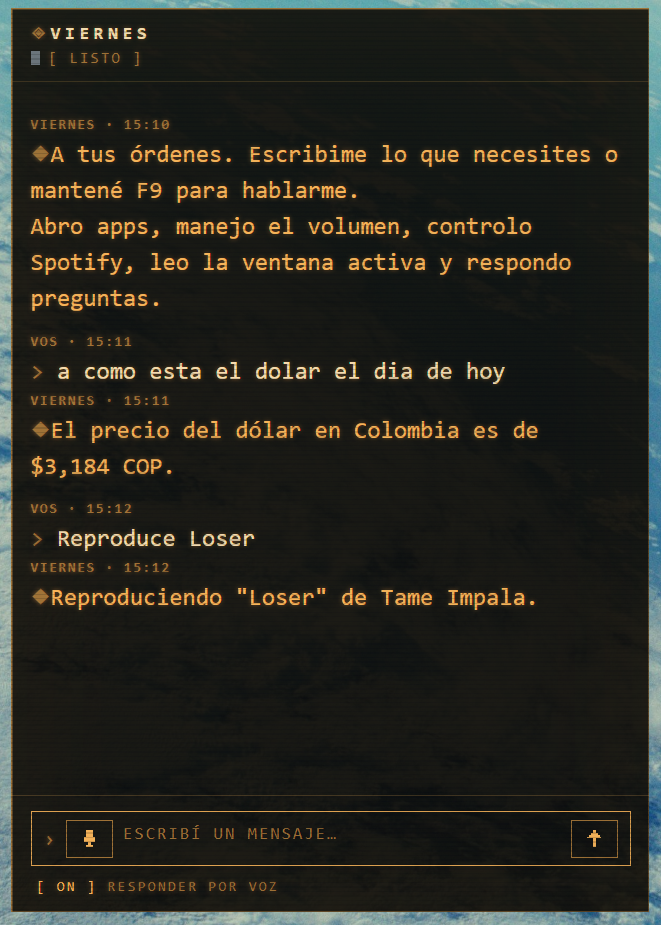
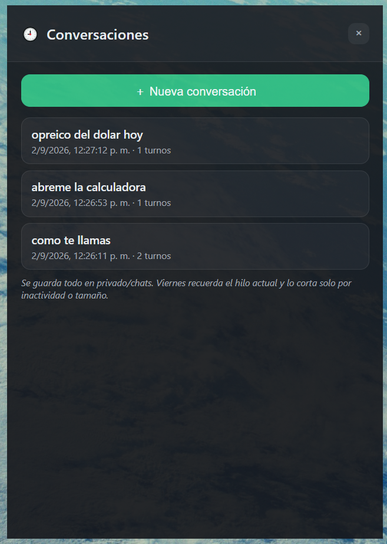
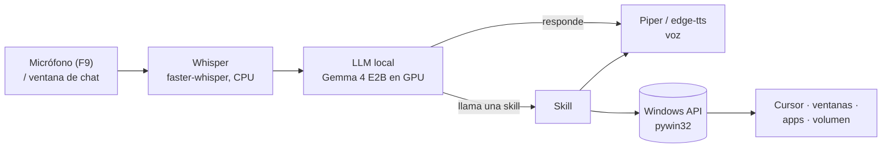

# Viernes

**IA local con _tool calling_ para manejar una PC con Windows por voz — sin nube, sin suscripciones.**

<p>
  
  
  
  
  
</p>

Se mantiene apretada una tecla (F9) y se habla. `faster-whisper` transcribe, un
LLM que corre **en la propia GPU** (`Gemma 4 E2B`) decide si responde directo o
ejecuta una _skill_, y contesta en voz alta. También hay una ventana de chat para
escribirle: mismo motor local, mismas skills, misma conversación.

> Asume **Windows 10** y una sola PC de usuario. Todo el código, los comentarios y
> los commits están en español, a propósito.

<p align="center">
  
  
</p>
<p align="center"><sub>Tema <b>retro</b> (CRT ámbar) · historial de conversaciones en tema <b>moderno</b></sub></p>

---

## Qué hace

- **Voz push-to-talk (F9)** y **ventana de chat** — mismo motor, misma memoria.
- **10 skills / 25 tools**: abrir apps y carpetas, volumen, Spotify (Premium),
  búsqueda web, ChatGPT, cerrar/leer ventanas, hora, rutina de inicio y el
  **mouse gestual**.
- **Memoria conversacional**: recuerda el hilo actual (resumen + últimos turnos)
  y lo corta solo por inactividad o tamaño.
- **Todo offline salvo lo que pida internet**: STT, LLM y TTS (Piper) corren en
  la máquina; solo Spotify, la búsqueda web y ChatGPT salen a la red.

## Cómo funciona



- **Modelo:** `Gemma 4 E2B` (variante litert-lm, cuantizada) — entra en los 4 GB
  de VRAM de una GTX 1650. Runtime `litert-lm-api`, backend GPU (~1–2 s/comando).
- **Tool calling automático:** cada skill es una función Python con _type hints_
  y docstring `Args:`; `litert-lm-api` arma el schema y la ejecuta cuando el
  modelo la llama.
- **Memoria** (`core/memoria.py`): el motor no guarda estado entre turnos, así
  que la conversación (resumen progresivo + ventana de turnos verbatim) se
  reconstruye y se antepone en cada turno. Voz y chat comparten el mismo hilo.

Alternativas descartadas y umbrales calibrados a mano: en los docstrings de cada
módulo.

## Skills

| Skill | Qué hace |
|---|---|
| **apps** | Abre aplicaciones instaladas (índice real de los `.lnk` del Menú Inicio, fuzzy-match) |
| **carpetas** | Abre Escritorio/Documentos/Descargas y proyectos por nombre aproximado |
| **volumen** | Volumen maestro: fijar %, subir, bajar, silenciar, consultar |
| **ventanas** | Cierra / minimiza ventanas por título; si hay ambigüedad, pregunta |
| **internet** | Búsqueda web con Tavily (respuesta ya redactada); sin key cae a ChatGPT |
| **chatgpt** | Pregunta a ChatGPT vía navegador (solo si el usuario lo nombra) |
| **spotify** | Reproduce canción/playlist/mood, siguiente/anterior, pausa (requiere Premium) |
| **tiempo** | Hora y fecha actual |
| **rutina** | "Modo trabajo": abre tus apps y pone tu playlist en aleatorio |
| **manos_libres** | Enciende/apaga el mouse gestual (proceso aparte) |

Agregar una capacidad = agregar un módulo en `agente/skills/` con `TOOLS = [...]`.

## El mouse gestual

Una webcam + MediaPipe siguen ambas manos; con gestos simples (pellizco, puño,
palma) se maneja el cursor real, se arrastran y redimensionan ventanas, se hace
scroll y Aero Snap. Fue lo primero que se construyó y de ahí nació el proyecto;
hoy es una skill más. Corre como proceso aparte y `agente/` no lo importa nunca.

Detalle completo en [`mouse_gestual/README.md`](mouse_gestual/README.md).

| Gesto | Acción |
|---|---|
| Pellizco corto (pulgar + índice) | Click izquierdo |
| Pellizco sostenido, una mano | Arrastrar la ventana bajo el cursor |
| Pellizco con **ambas** manos | Redimensionar |
| Puño sostenido mientras se arrastra | Cerrar la ventana (cancelable) |
| Puño sin ventana agarrada | Scroll vertical, con inercia |
| Ventana contra un borde | Aero Snap (maximizar / media pantalla) |

## Instalación

Requiere **Windows 10** y **Python 3.11**.

```powershell
python -m venv venv
./venv/Scripts/python.exe -m pip install -r requirements.txt
./venv/Scripts/python.exe -m playwright install chromium   # skill chatgpt

# voz local offline (~60 MB, no va en el repo):
./venv/Scripts/python.exe -m piper.download_voices es_MX-claude-high --data-dir privado/voz_piper
```

Antes de la primera corrida (nada de esto se sube a git):

```powershell
cp agente/config.example.json agente/config.json   # editar llm.model_path, etc.
cp agente/.env.example        agente/.env           # solo para Spotify / Tavily
```

- **`config.json`** — ajustes **no secretos** de la máquina: ruta al `.litertlm`,
  backend (`gpu`/`cpu`), modelo de Whisper, voz, tecla de push-to-talk, memoria,
  rutina de inicio. Plantilla: `config.example.json`.
- **`.env`** — **solo credenciales**: `SPOTIFY_CLIENT_ID` / `SPOTIFY_CLIENT_SECRET`,
  `TAVILY_API_KEY`. El resto del agente funciona sin esto.

El modelo del LLM se consigue aparte (Hugging Face, `litert-community/gemma-4-E2B-it-litert-lm`)
y su ruta va en `config.json`.

## Uso

```powershell
./venv/Scripts/python.exe agente/main.py            # el asistente (F9 para hablar)
./venv/Scripts/python.exe mouse_gestual/main.py     # el mouse gestual (q para salir)
```

Mantené **F9** para hablar o escribí en la ventana de chat (tiene su propio botón
de micrófono). El ícono de la bandeja muestra el estado (gris = esperando,
azul = grabando, naranja = procesando). Se sale por el menú del ícono.

La ventana de chat tiene dos temas conmutables en caliente (**moderno** glass y
**retro** CRT ámbar), un panel **⚙ Personalizar** que ajusta color, fuente, skills
activas, atajos, voz y opacidad sin tocar archivos, y un historial 🕘 de
conversaciones.

**Spotify** (una vez): `./venv/Scripts/python.exe agente/scripts/spotify_auth.py`.

**Abrir por teclas + doble palmada** (opcional): dejar corriendo
`agente/scripts/abrir_por_palmada.py` (acceso directo al `.vbs` en `shell:startup`).

## Desarrollo

```powershell
./venv/Scripts/python.exe -m pip install -r requirements-dev.txt
./venv/Scripts/python.exe -m ruff check .     # lint
./venv/Scripts/python.exe -m ruff format .    # formato
```

No hay tests, build step ni argumentos de CLI.

## Stack

| Área | Herramienta |
|---|---|
| STT | `faster-whisper` (`small`, CPU, `int8`) — backend `ctranslate2`, sin torch |
| LLM | `litert-lm-api` + `Gemma 4 E2B` en GPU |
| TTS | `piper` (local, voz `es_MX-claude-high`) con `edge-tts` de respaldo; MCI para reproducir |
| Voz / hotkey | `sounddevice`, `keyboard` (hook global) |
| Bandeja / chat | `pystray` + `Pillow`; `pywebview` + `pythonnet` sobre WebView2 |
| Visión | `mediapipe` (HandLandmarker), `opencv-python` |
| Windows | `pywin32`, `pycaw` + `comtypes` (volumen) |
| Web | `playwright` (Chromium), Tavily vía `urllib` |

## Hardware de referencia

Todo se probó y ajustó en esta máquina:

- **CPU** i5-10300H · **GPU** GTX 1650, **4 GB VRAM** · **~16 GB RAM**
- **OS** Windows 10 IoT Enterprise LTSC 2021 (no 11, sin NPU / Copilot+)
- Con 4 GB de VRAM entra cómodo un modelo de 3–4B; los de 7–8B con offload parcial.
- El _delegate_ GPU de MediaPipe está deshabilitado en el build pip de Windows:
  HandLandmarker corre en CPU (~80 fps, no es el cuello de botella).

## Estado

- ✅ **Mouse gestual** — completo y estable.
- ✅ **Asistente de voz + chat con LLM local** — pipeline funcionando.
- 🔜 De acá en adelante: sumar skills nuevas.

`privado/` y `prototipos/` son carpetas locales (gitignored): notas, modelos
descargados, perfiles de navegador, logs y los scripts de prueba con los que se
fue armando el asistente.
